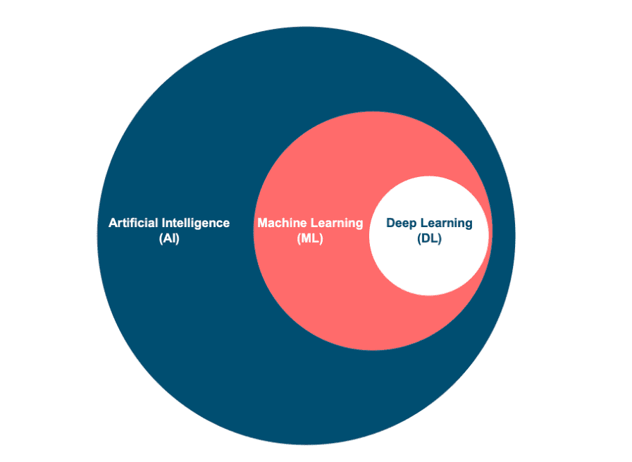

This aims to be a quick cheatsheet for biologists to understand the basics of deep learning. This is a polished and structured version of more personal notes that I have took during my studies and work. I will update it as I learn more. 

# Artificial Intelligence, Machine Learning, Deep Learning
These three terms are often used interchangeably, but they represent different levels of abstraction in the field of intelligent systems. Let's break down what each of them means, their relationship, and their role in the modern tech landscape.

We can simply define them as:
- Artificial Intelligence (AI): The broadest field that encompasses any technique that allows machines to mimic human-like cognitive functions (for example the first alogoritms to play chess)
- Machine Learning (ML): A subset of AI that focuses on building models that can learn from data and make predictions or decisions without being explicitly programmed (in this case, we have simple models like linear regression and more complex models like decision trees and random forests) 
- Deep Learning (DL): A subset of ML that uses neural networks with multiple layers to learn hierarchical representations of data (multiple layers allow the model to learn more complex patterns. This is currently the most applied and researched field in AI)

## Deep Learning
Broadly, **deep learning** refers to a class of machine‑learning methods that use *deep neural networks* — models composed of many layers of interconnected units (neurons) — to learn representations of data automatically, often from raw or minimally processed inputs.  

In contrast to *traditional* machine learning, where features are hand‑crafted (e.g. domain‑specific engineered features) and then passed to classical algorithms (like SVMs, random forests, logistic regression), deep learning often removes the need for manual feature engineering. The network learns hierarchical features internally building internal and higher abstractions.  

The basic building blocks of a neural network are:
- *Neurons*: The basic unit of a neural network. They receive inputs, perform a transformation, and produce an output. We can consider neurons as units that perform simple linear operations on inputs: $x$, output: $y$. $$y = f(x, w, b)$$. The weights $w$ and bias $b$ are learnable parameters, so elements that change during training. 

$$y = f(x, w, b) = \text{activation}(xw + b)$$

>[!NOTE]
> remember from your classes of algebra that a linear function can be represented as $y=ax+b$, where $a$ is the slope and $b$ is the intercept. In this case, $x$ is the input, $y$ is the output, $a$ is the weight and $b$ is the bias.

- *Activation functions*: are functions that are applied to the output of a neuron. They are essential to break the linearity of the network and allow it to learn complex patterns.The most famous ones are ReLU, sigmoid, tanh. $$y = ReLU(xw^T + b)$$

- *Layers*: we can stuck multiple neurons together to form a layer, and multiple layers to form a network. The first layer is the input layer, the last layer is the output layer. The more layers we have, the deeper the network. The number of nerons at each layer is called the width of the network, capacity or model dimension. The total sum of the neurons in the network is called the number of parameters.

>[!NOTE]
> GPT5 contains $10^{11}$ parameters, while average human has $10^{11}$ neurons, and average protein language model has $10^{6}$ parameters. 

### Training:
A core element of deep learning is the training process. During training, the weights and biases of the network are adjusted to minimize the loss function. To conceptualize this, let’s imagine we have a few data points and a simple neural network with one neuron. The goal is to find the best function $f$ that interpolates these data points. In other words, we aim to find the function $f$ that, given an input $x$, returns an output $y$, which most accurately represents the true relationship between $x$ and $y$.

Intuitively, we can start by randomly generating a function $f$ and then evaluating its performance on the data points. To do this, we compute the difference between the predicted values and the true values. This difference is quantified using a loss function. In the ideal case, the loss function should be as small as possible, meaning the function $f$ predicts the outputs very accurately.

Once we have the loss function, we can then update the weights and biases of the network to minimize this loss. This process is called training. 
>[!IMPORTANT]
>But how do we perform these updates and determine the amount by which we should adjust the parameters? This is a complex problem that is solved through optimization algorithms.

#### Backpropagation

Backpropagation is the algorithm used to compute the gradients of the loss function with respect to each parameter (weight and bias) in the network. These gradients are then used to update the parameters during the optimization process. The process of backpropagation works by applying the chain rule of calculus, which allows us to compute how the loss changes with respect to each weight and bias in the network.

>[!NOTE]
The chain rule is one of the most important rules in differential calculus. It allows us to compute the derivative of a composite function — that is, a function that is the composition of two or more functions. The chain rule tells us how to take the derivative of a function that is made up of other functions.

Definition of the Chain Rule:

If you have two functions $f(x)$ and $g(x)$, the composite function $h(x)$ is defined as:

$$h(x)=f(g(x))$$

The chain rule states that the derivative of this composite function $h(x)$ with respect to $x$ is the derivative of $f$ with respect to $g(x)$, multiplied by the derivative of $g(x)$ with respect to $x$: $$\frac{d}{dx}f(g(x))=\frac{df}{dg}\cdot\frac{dg}{dx}$$

Where:

$$\frac{df}{dg}$$ is the derivative of $f$ with respect to $g(x)$ (treating $g(x)$ as the variable).

$$\frac{dg}{dx}$$ is the derivative of $g(x)$ with respect to $x$.

$$\frac{d}{dx}f(g(x))=\frac{df}{dg}\cdot\frac{dg}{dx}$$

Where:

$$\frac{df}{dg}$$ is the derivative of $f$ with respect to $g(x)$ (treating $g(x)$ as the variable).

$$\frac{dg}{dx}$$ is the derivative of $g(x)$ with respect to $x$.

General Form of the Chain Rule:

For a composite function involving multiple nested functions, the chain rule extends to:

$$\frac{d}{dx}f(g(h(x)))=\frac{df}{dg}\cdot\frac{dg}{dh}\cdot\frac{dh}{dx}$$

Where:

$$\frac{df}{dg}$$ is the derivative of $f$ with respect to $g(x)$ (treating $g(x)$ as the variable).

$$\frac{dg}{dh}$$ is the derivative of $g(x)$ with respect to $h(x)$ (treating $h(x)$ as the variable).

$$\frac{dh}{dx}$$ is the derivative of $h(x)$ with respect to $x$.

This is useful when you have several functions nested within each other. You apply the chain rule repeatedly to compute the derivative of each nested function.

Where:

$$\frac{df}{dg}$$ is the derivative of $f$ with respect to $g(x)$ (treating $g(x)$ as the variable).

$$\frac{dg}{dx}$$ is the derivative of $g(x)$ with respect to $x$.

General Form of the Chain Rule:

For a composite function involving multiple nested functions, the chain rule extends to:

$$\frac{d}{dx}f(g(h(x)))=\frac{df}{dg}\cdot\frac{dg}{dh}\cdot\frac{dh}{dx}$$

This is useful when you have several functions nested within each other. You apply the chain rule repeatedly to compute the derivative of each nested function.

The chain rule essentially breaks down the process of taking the derivative of a complex function into smaller, manageable pieces. Here's the intuition:

How does $f(g(x))$ change when $x$ changes?

First, look at how $g(x)$ changes when $x$ changes.

Then, look at how $f(g(x))$ changes as $g(x)$ changes.

Multiply these changes:

The change in $f(g(x))$ is the product of the change in $g(x)$ with respect to $x$ and the change in $f(g(x))$ with respect to $g(x)$.

Example 1: Simple Chain Rule

Let’s say we have the following composite function:

$$h(x)=sin(x^2)$$

We want to find the derivative of $h(x)$ with respect to $x$.

Here, we can think of the function as $h(x)=f(g(x))$, where:

$$f(u)=sin(u)$$

$$g(x)=x^2$$
    
Using the chain rule, we get:

$$\frac{d}{dx}sin(x^2)=\frac{df}{dg}\cdot\frac{dg}{dx}$$

First, compute the derivative of $sin(u)$ with respect to $u$: $\frac{d}{du}sin(u)=cos(u)$

Then, compute the derivative of $x^2$ with respect to $x$: $\frac{d}{dx}x^2=2x$

Now, apply the chain rule: $\frac{d}{dx}sin(x^2)=cos(x^2)\cdot2x$

Thus, the derivative of $sin(x^2)$ with respect to $x$ is: $\frac{d}{dx}sin(x^2)=2xcos(x^2)$

##### Key Steps in Backpropagation:

##### Forward Pass: During the forward pass, the input data is passed through the network layer by layer, and the output of each neuron is computed based on its activation function and the weights.

##### Loss Calculation: After the forward pass, we calculate the loss function (such as Mean Squared Error or Cross-Entropy Loss) by comparing the model’s predictions to the true labels.

##### Backward Pass: We then perform the backward pass to calculate the gradients of the loss with respect to each weight and bias. The chain rule is used here to compute the gradient of the loss by propagating the error backward from the output layer to the input layer.

For each neuron, we compute the error term (how much that neuron’s output contributed to the total error) and then use it to calculate how the weights should be adjusted.

The gradients are computed from the output layer back to the input layer, adjusting the weights and biases step by step.

Gradient Calculation: The gradients of the loss with respect to each weight and bias are then calculated using the following equation:

$$\frac{\partial L}{\partial w_j}, \frac{\partial L}{\partial b_j}$$

These gradients tell us how to adjust each weight and bias to minimize the loss.

#### Optimization Algorithms

Once the gradients are computed through backpropagation, optimization algorithms are used to update the weights and biases to minimize the loss function. The most commonly used optimization algorithm in neural networks is Gradient Descent.

##### Gradient Descent:

Gradient Descent is an optimization algorithm used to minimize the loss function by iteratively adjusting the weights and biases in the direction of the negative gradient (i.e., in the direction that reduces the loss). The amount by which the weights are adjusted is determined by the learning rate.

##### Optimization Algorithms

Once the gradients are computed through backpropagation, optimization algorithms are used to update the weights and biases to minimize the loss function. The most commonly used optimization algorithm in neural networks is Gradient Descent.

##### Gradient Descent:

Gradient Descent is an optimization algorithm used to minimize the loss function by iteratively adjusting the weights and biases in the direction of the negative gradient (i.e., in the direction that reduces the loss). The amount by which the weights are adjusted is determined by the learning rate.

The basic update rule in gradient descent is:

$$w_j \leftarrow w_j - \eta \cdot \frac{\partial L}{\partial w_j}$$

Where: η is the learning rate, a small positive number that determines how big the step should be. It is the gradient of the loss with respect to the weight.

Similarly, biases are updated with the same rule:

$$b_j \leftarrow b_j - \eta \cdot \frac{\partial L}{\partial b_j}$$

Types of Gradient Descent:

- Batch Gradient Descent: Uses the entire dataset to compute the gradient for each update. This is computationally expensive for large datasets.

- Stochastic Gradient Descent (SGD): Updates the weights after processing one data point. This makes the training faster but introduces more noise in the updates, which can sometimes help the model escape local minima.

- Mini-Batch Gradient Descent: A compromise between batch and stochastic gradient descent. The dataset is divided into small batches, and the gradient is calculated on each mini-batch. This is the most commonly used variant in deep learning because it balances efficiency and stability.

- *Loss & optimization*: During training, a loss function measures discrepancy between predictions and ground truth, and backpropagation + optimization (e.g. SGD, Adam) updates weights to minimize loss.  

- *Overfitting vs underfitting*: With too much capacity (many parameters), network may “memorize” training data and fail to generalize — overfitting. With too little capacity, underfitting occurs. Regularization (dropout, weight decay), validation sets, early stopping are strategies to control this.  

Deep learning’s strength lies in learning complex patterns directly from raw data, but it requires large data, computational resources, and care with generalization.  

Acknowledgements: 
- Mathys Gapole for the idea about the neurons and the backpropagation visualization